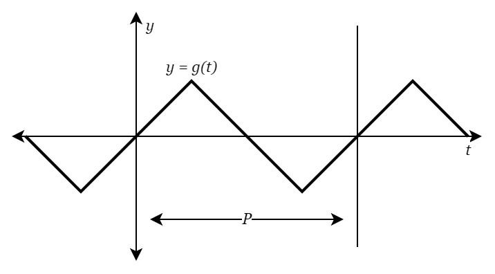

# ONLINE GRAPHING SYNTHESIZER #

Created by Team Falcons

Hasan Al-Zubeidi\
Johannes Arenander\
Rasmus Danielsson\
Isak Nyberg\
Atheer Salim\
Lucas Werelius

---

## INTRODUCTION ##

This project was created in the course II1305 Project in Information and Communications Technology, offered by KTH Royal Institute of Technology.

A synthesizer is an electronic musical instrument, and our version creates sound using mathematical functions. The user provides a mathematical function, and an interval, which creates a periodic waveform. The user can then play the waveform for different musical notes on the keyboard.

## METHOD ##

Our synthesizer creates a periodic waveform from a constrained mathematical function.

