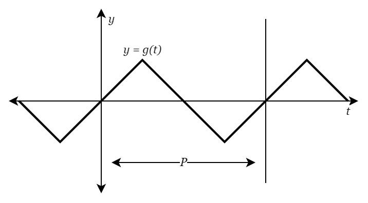

# ONLINE GRAPHING SYNTHESIZER #

Created by Team Falcons

Hasan Al-Zubeidi\
Johannes Arenander\
Rasmus Danielsson\
Azer Hojlas\
Isak Nyberg\
Atheer Salim\
Lucas Werelius

---

## INTRODUCTION ##

This project was created in the course II1305 Project in Information and Communications Technology, offered by KTH Royal Institute of Technology.

A synthesizer is an electronic musical instrument, and our version creates sound using mathematical functions. It is also available online, as a web-based application! The user provides a mathematical function, and an interval, which creates a periodic waveform. The user can then play the waveform on the keyboard.

## METHOD ##

Our synthesizer creates sound by repeatedly playing a periodic waveform from a constrained mathematical function.

The detailed steps are as follows: Initially, a user defined mathematical function *g* is parsed from input. We will not dive into this since it's not part of the audio synthesis technique (and also quite boring). The following step is to buffer the audio signal when a musical note is played (which is what happens when a key on the synth is pushed). This part is quite simple, and only requires computing the samples for the waveform for a given frequency (note), and then repeatedly looping through those samples. That's it, that is how the synth makes sound!